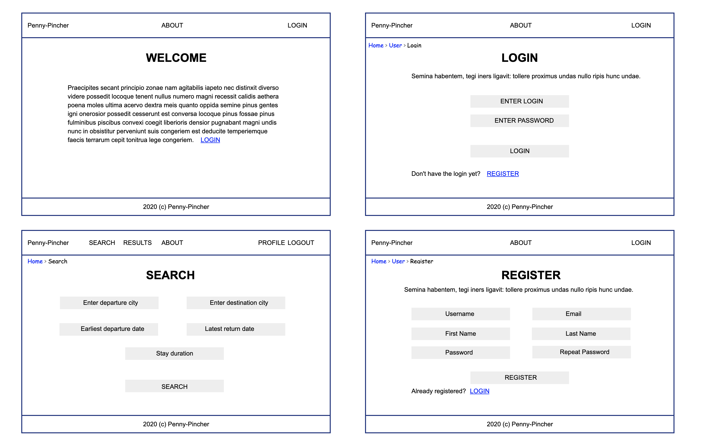
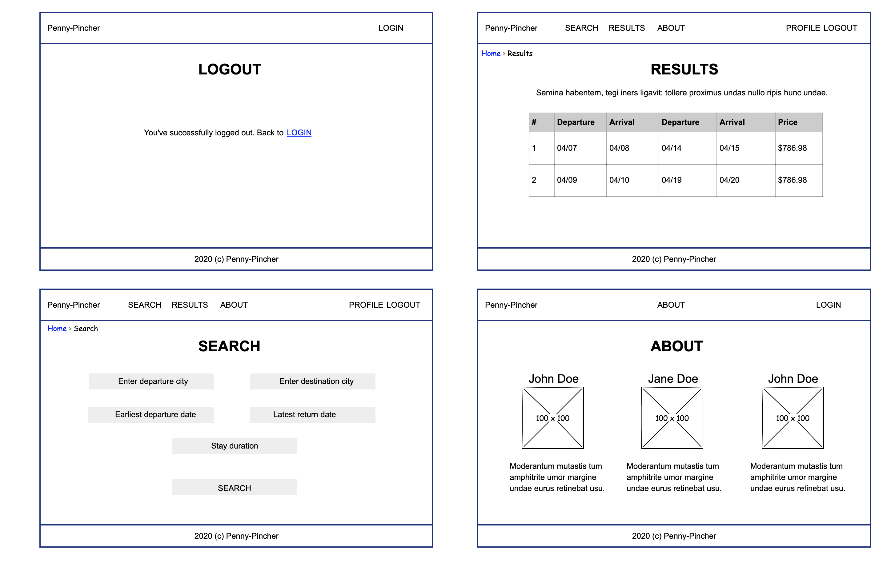
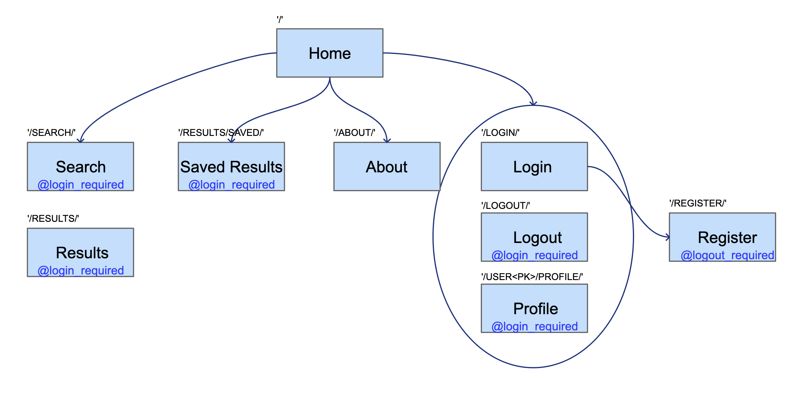
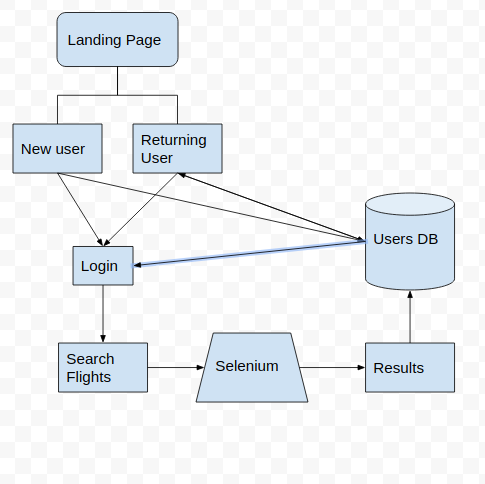
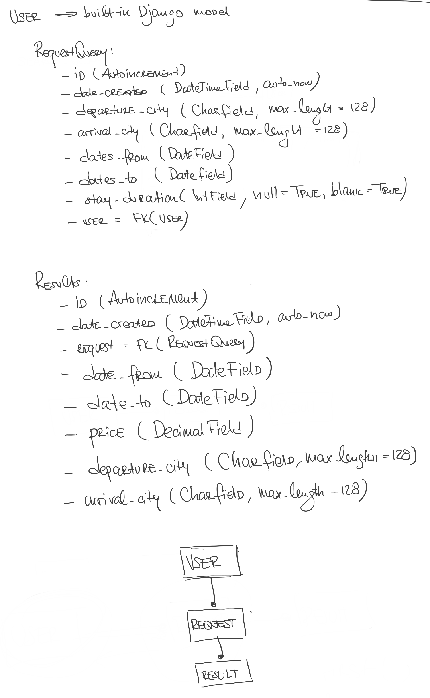

# PENNY-PINCHER

An app that helps user search for the cheapest possible flights within the given date range. Include in the search the airlines that don’t have APIs by utilizing Selenium and web scraping.

## AUTHORS

[_Leo Kukharau_](https://github.com/LeoKuhorev), [_Joseph Lee_](https://github.com/josephlee3454), [_Chuck Li Villalobos_](https://github.com/ticochuck)

## MVP LAYOUT WIREFRAME

## MVP ROUTES

## DOM

## GETTING STARTED:

- `poetry shell` to start your virtual environment
- `poetry install` to install dependencies
- create .env file with listed <a href="#env">below</a> variables and save it into 'penny_pincher' directory
- `python manage.py makemigrations` - to generate DB schema
- `python manage.py migrate` - to create DB schema
- `python manage.py createsuperuser` - to create user with admin access
- `python manage.py collectstatic` - to collect apps static files
- `python manage.py runserver` - to run server

If you're having troubles with installing `psycopg2` try this solution (for Mac users):  
`brew install openssl`  
`export LIBRARY_PATH=$LIBRARY_PATH:/usr/local/opt/openssl/lib/`  
`pip3 install psycopg2`

###  ENV variables:

SECRET_KEY=secret key for the app (typically 50-characters long string)  
DEBUG=should be set to True in development  
ALLOWED_HOSTS=localhost,127.0.0.1 (for testing)

## API:

`/` - welcome page;  
`/login/` - login page, allows a user to log in;  
`/register/` - register page, handles user registration;  
`/logout/` - logout page, is shown when a user it logged out;  
`/admin/` - site admin page;

## Additional information:

[Requirements](./docs/requirements.md)  
[Workflow](./docs/workflow.md)  
[Project Management](https://github.com/401n1-midterm/penny-pincher/projects/1)

### DB Schema:

### Dependency Documentation:

[Python (v. 3.8)](https://docs.python.org/3.8/)  
[Django (v. 3.1)](https://docs.djangoproject.com/en/3.1/)  
[Selenium (v. 3.141.0)](https://pypi.org/project/selenium/)

### Dev Dependencies:

[Pylint-Django (v. 2.3.0)](https://pypi.org/project/pylint-django/)
